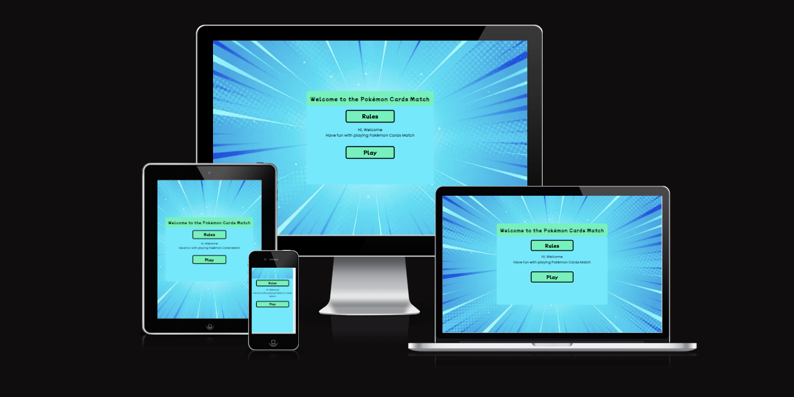
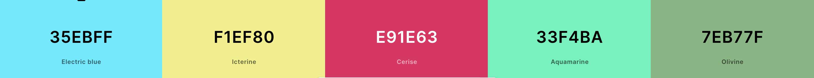
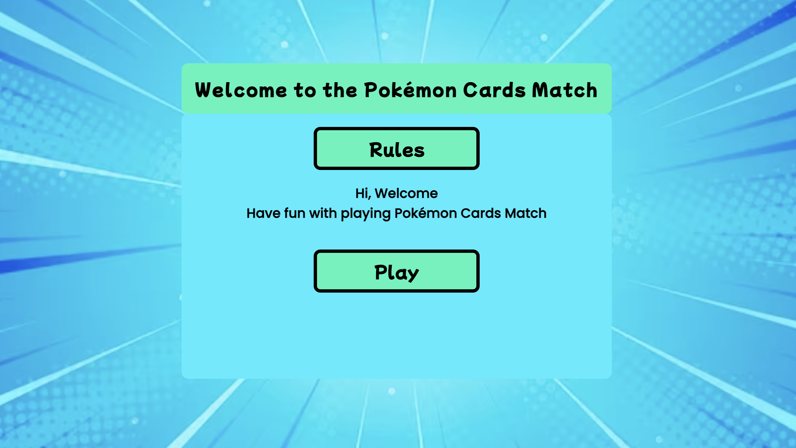
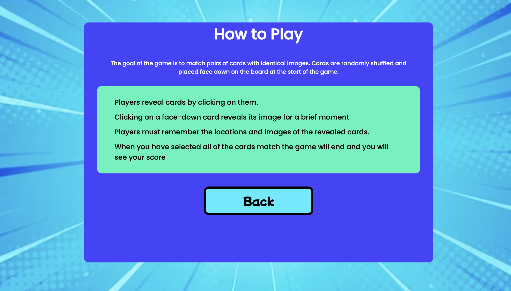
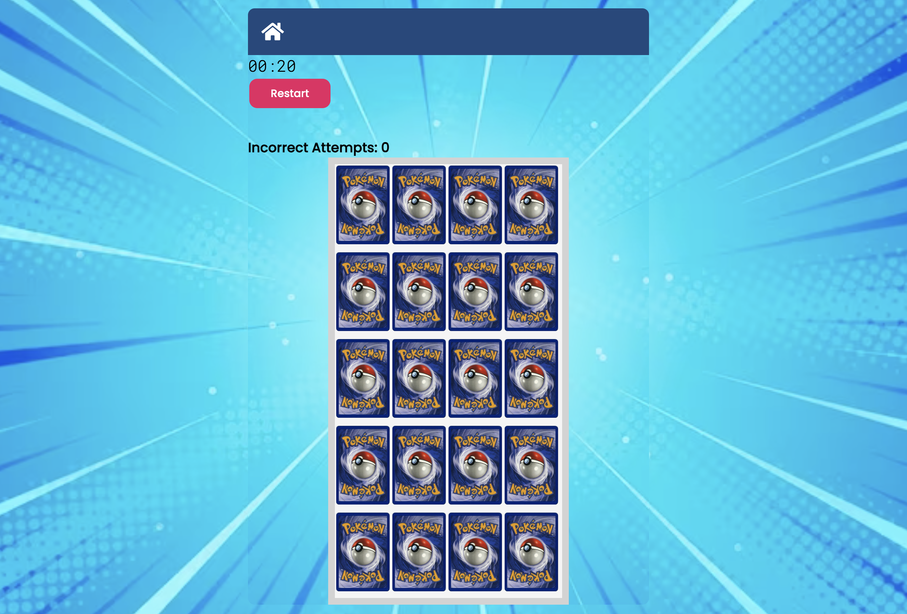
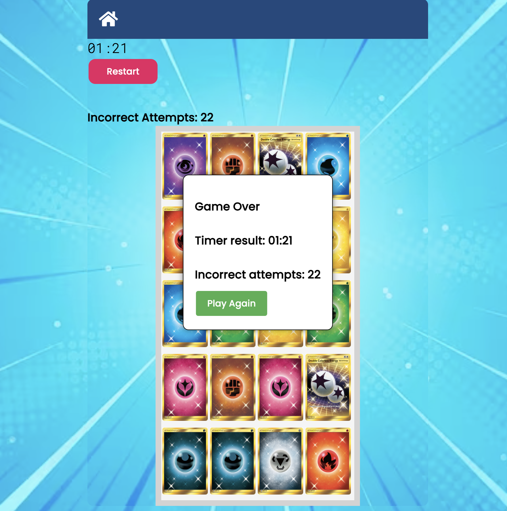
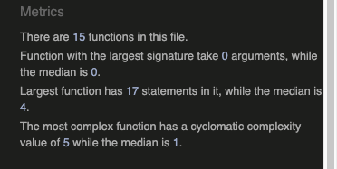

# The Pokémon Cards Match 

Welcome to the Pokémon Cards Match project! This is a simple web-based card-matching game featuring Pokémon cards.

### Rules for the Memory-Matching Game:

#### Objective:

The goal of the game is to match pairs of cards with identical images.

#### Board Setup:

- The game board is a grid with dimensions determined by the rows and columns variables (4x5 in this case).
- Cards are randomly shuffled and placed face down on the board at the start of the game.

### Gameplay:

- Players reveal cards by clicking on them.
- Clicking on a face-down card reveals its image for a brief moment.
- Players must remember the locations and images of the revealed cards.

### Matching:

- If two clicked cards have the same image, they remain face up, and the player scores a match.
- If the images are different, both cards are flipped face down, and the player accumulates an error.

### Incorrect Attempts:

- The number of errors is tracked by the errors variable.
- For each unsuccessful attempt (pair of non-matching cards), the error count increases.
- The error count is displayed on the HTML element with the id "errors."

### Winning:

- The game continues until all pairs of cards are successfully matched.
- Players aim to complete the game with the fewest errors possible.
- when the game done a Show Modal appears with Game Over, Timer result und Incorrect attempts.

### Game Flow:

- Cards are initially hidden for 1 second (setTimeout(hideCards, 1000)) after the board is set up.
- Players take turns clicking on pairs of cards to reveal their images.
- The game automatically hides the cards after an unsuccessful attempt to match a pair.

### User Interface:

-The game board is represented by a grid of cards displayed on the HTML page.
- Errors are visually represented, and the count is updated in real-time.

### Technical Details:

- The game logic is implemented using JavaScript.
- Card shuffling is done using the Fisher-Yates (Knuth) algorithm.
- Event listeners handle card clicks and trigger the appropriate game functions (selectCard, update).

### Game Initialization:

- The game starts when the window loads, with cards shuffled and the board set up.

### Game Completion:

- The game is considered complete when all pairs are successfully matched.
- Remember, the success of the game depends on memory and pattern recognition skills. Players aim to minimize errors and complete the game as efficiently as possible.

The live link can be found here - [ The Pokémon Cards Match Game]( https://noah-samawi.github.io/Pokemon-Cards-Match-pp2/)

 

Table of Contents

- [The Pokémon Cards Match](#the-pokémon-cards-match)
    - [Rules for the Memory-Matching Game:](#rules-for-the-memory-matching-game)
      - [Objective:](#objective)
      - [Board Setup:](#board-setup)
    - [Gameplay:](#gameplay)
    - [Matching:](#matching)
    - [Incorrect Attempts:](#incorrect-attempts)
    - [Winning:](#winning)
    - [Game Flow:](#game-flow)
    - [User Interface:](#user-interface)
    - [Technical Details:](#technical-details)
    - [Game Initialization:](#game-initialization)
    - [Game Completion:](#game-completion)
  - [Site Owner Goals](#site-owner-goals)
  - [User Stories](#user-stories)
  - [Design](#design)
    - [Imagery](#imagery)
    - [Colour Scheme](#colour-scheme)
    - [Fonts](#fonts)
    - [Layout](#layout)
  - [Features](#features)
    - [Home Page](#home-page)
    - [How to Play Page](#how-to-play-page)
    - [Game Selection](#game-selection)
    - [Game Area](#game-area)
    - [Game Over](#game-over)
    - [Features Left to Implement](#features-left-to-implement)
  - [Testing](#testing)
    - [Validator Testing](#validator-testing)
    - [Accessibility](#accessibility)
    - [Input Testing](#input-testing)
    - [Button Testing](#button-testing)
    - [Game Testing](#game-testing)
    - [Browser Testing](#browser-testing)
    - [Device Testing](#device-testing)
    - [Fixed Bugs](#fixed-bugs)
      - [SetTimeout() method on incorrect cards](#settimeout-method-on-incorrect-cards)
      - [Making a Deep Clone of an Object](#making-a-deep-clone-of-an-object)
      - [Username Input Data Validation](#username-input-data-validation)
    - [Known Bugs](#known-bugs)
  - [Technologies Used](#technologies-used)
    - [Languages](#languages)
    - [Frameworks - Libraries - Programs Used](#frameworks---libraries---programs-used)
  - [Deployment](#deployment)
  - [Cloning](#cloning)
  - [Credits](#credits)
    - [Media](#media)
    - [Resources Used](#resources-used)
  - [Acknowledgments](#acknowledgments)

<small><i><a href='http://ecotrust-canada.github.io/markdown-toc/'>Table of contents generated with markdown-toc</a></i></small>

## Site Owner Goals
To provide the user with an easy to navigate game that is both fun and educational.
- To present the user with a website that is visually appealing and fully responsive.
- To allow the user to choose from a selection of habitats and.
- Invoke a sense of urgency to complete the game as quickly as possible. 

## User Stories

- ### First Time User
  - As a first time user I want to understand the main purpose of the game
  - As a first time user I want to be able to intuitively navigate the game, choose my level of difficulty, choose a habitat, play the game, see my score and restart the game once it ends.
  - As a first time user I want to have fun 

- ### Returning user
  - As a returning user I want to be able to play the same game without getting the same selection of animals.
  - As a returning user I want to be able to play a different game (different habitat).
  - As a returning user I want to be able to save my score to the leaderboard.

- ### Returning user
  - As a returning user I want to be able to play the same game without getting the same selection of cards.
 
## Design

### Imagery
- The imagery and colour scheme of the site were both given careful consideration to ensure they compliment each other. The imagery used in the game is very important to the overall experience of the user. 

### Colour Scheme

Colour palette from Coolors

- The colour scheme of the site is mainly lavender,green, dark green and Aquamarina with varying shades of green used to tie in with the nature imagery.

- The color scheme of the site ties in with the main homepage image and the color picker Chrome extension was used to pull out the main colours as seen in the colour palette. These were then used throughout the site. 

### Fonts
The Poppins font is the main font used throughout the whole website. This font was imported via [Google Fonts](https://fonts.google.com/). The Mochiy Pop P One font is used for the main header and buttons to give a playful feel.  

Sans Serif is used as a backup font, in case for any reason the main font isn't being imported into the site correctly.

### Layout
The site is a single page with 3 sections:
  - Welcome area
  - Rules
  - Play game

**### Wireframes

Wireframes were produced using Balsamiq.

 

 
Desktop Wireframe

 

 

    
Mobile Wireframe

 

**
## Features

### Home Page

The landing page of the website has a very simple layout which includes a H1 heading stating and the name of the game and too large colourful interactive buttons that are easy for user to select. The user is given too options to choose from:
 - Rules
 - Play

 

### How to Play Page

If the user clicks the "Rules" button the instructions section appears and the user can read the main rules of the game. The back button will take them back to the welcome area.

### Game Selection

- There are one levels to choose. 

### Game Over
- The section shows the players score which includes their time, number of incorrect attempts.

### Features Left to Implement
- Email JS to signup to newsletter
- Ability to play sounds

## Testing

### Validator Testing
- #### HTML
    - No errors were returned when passing through the official W3C Markup Validator
        - [W3C Validator Results](https://validator.w3.org/nu/?doc=https%3A%2F%2Fnoah-samawi.github.io%2FPokemon-Cards-Match-pp2%2F)
- #### CSS
    - No errors were found when passing through the official W3C CSS Validator 
        - [W3C CSS Validator Results](https://jigsaw.w3.org/css-validator/validator?uri=https%3A%2F%2Fnoah-samawi.github.io%2FPokemon-Cards-Match-pp2%2F&profile=css3svg&usermedium=all&warning=1&vextwarning=&lang=en)
- #### Javascript
    - No errors or warnings were returned when passing through the the [JSHint Validator](https://jshint.com/)

  
  

### Accessibility 
- The site achieved a Lighthouse accessibility score of 100% on both mobile and desktop which confirms that the colours and fonts chosen are easy to read and accessible

Mobile Lighthouse Score

Desktop Lighthouse Score

### Input Testing
- The username text input has been tested to ensure it won't save to the leaderboard unless text is inputted into the field.

### Button Testing
- All buttons were tested manually to ensure the user is directed to the correct section of the website and functions run as intended.

### Game Testing
- The game was thoroughly tested by friends and family to ensure that everything worked as intended including the following:
  - Correct and incorrect Pokémon cards were shuffled.
  - The same Pokémon card didn't appear twice in the same game. 
  - The game shows a different selection of cards each time it's played.
  - The scene background changes to match the habitat selected.
  - The game ends once all the correct Pokémon Cards Match have been selected.
  - The timer stops when the game ends.
  - The incorrect attempts counter(errors) captures all incorrect clicks.
  - The correct score is shown once the game ends.

### Browser Testing
- The Website was tested on Google Chrome, Firefox, Microsoft Edge, Safari browsers with no issues noted.
    
### Device Testing
- The website was viewed on a variety of devices such as Desktop, Laptop, iPhone 8, iPhoneX and iPad to ensure responsiveness on various screen sizes in both portrait and landscape mode. The website performed as intended. The responsive design was also checked using Chrome developer tools across multiple devices with structural integrity holding for the various sizes.
- I also used the following website to test responsiveness:
    - [Responsinator]()

### Fixed Bugs

#### SetTimeout() method on incorrect cards
- When the user selects an incorrect animal during the game a shake animation CSS rule is added to the animal card using a click listener. 
- When testing the game I noticed that once the card has been clicked once, the shake animation didn't fire on subsequent clicks. 
- In order to fix this I added the setTimeout() method to call a function to remove the CSS class after half a second (sufficient time for the animation to finish). This meant that for subsequent incorrect clicks, the shake animation rule could be added to the card again meaning that the card shakes each time it is clicked.

#### Making a Deep Clone of an Object
- In order to avoid having duplicated Pokémon Cards Matc showing in a game, each time an Pokémon card is written to the DOM it is spliced out of the Pokémon object. In order to avoid altering the original Pokémon card object I needed to first make a clone of the object and splice the Pokémon card out of the new object instead. 
- To do this, I first used the spread operator however I quickly noticed that I was not getting the results I expected and the original object was still being changed when I spliced the cloned object. 
- Upon researching this I realised the issue was that my Pokémon card object was actually a nested object. When you have a nested object and you copy it, nested objects inside that object will not be copied. Therefore, if you change the nested object, you will change it for both instances.
- To fix this I had to make a deep clone of the nested object by stringifying the object and parsing it right after - JSON.parse(JSON.stringify(a)). The following article was very useful : [How to differentiate between deep and shallow copies in JavaScript](https://www.freecodecamp.org/news/copying-stuff-in-javascript-how-to-differentiate-between-deep-and-shallow-copies-b6d8c1ef09cd/)

#### Username Input Data Validation
- In order to prevent the user saving a blank username to the leaderboard I wrote javaScript to prevent the score saving to the leaderboard if the text input value equaled an empty string. 
- However when I put my project into the peer review slack channel one of my peers kindly tested this validation and was able to save a blank username by inputting an empty space and then saving.
- In order to fix this I did a bit of research and found that the trim function could be used to prevent whitespace from being saved. I was able to amend my function to include this and now the username will only save if a character is inputted.

### Known Bugs
There are no known bugs.

## Technologies Used

### Languages
- JavaScript
- HTML5
- CSS3

### Frameworks - Libraries - Programs Used
- [Am I Responsive](http://ami.responsivedesign.is/) - Used to verify responsiveness of website on different devices.
- [Responsinator](http://www.responsinator.com/) - Used to verify responsiveness of website on different devices.
- [Balsamiq](https://balsamiq.com/) - Used to generate Wireframe images.
- [Chrome Dev Tools](https://developer.chrome.com/docs/devtools/) - Used for overall development and tweaking, including testing responsiveness and performance.
- [Font Awesome](https://fontawesome.com/) - Used for icons in information bar.
- [GitHub](https://github.com/) - Used for version control and hosting.
- [Google Fonts](https://fonts.google.com/) - Used to import and alter fonts on the page.
- [TinyPNG](https://tinypng.com/) - Used to compress images to reduce file size without a reduction in quality.
- [W3C](https://www.w3.org/) - Used for HTML & CSS Validation.
- [Coolors](https://coolors.co/) - Used to create colour palette.
- [Favicon](https://favicon.io/) - Used to create the favicon.

## Deployment

The site was deployed using GitHub pages. The steps to deploy using GitHub pages are:

1. Go to the repository on GitHub.com
2. Select 'Settings' near the top of the page.
3. Select 'Pages' from the menu bar on the left of the page.
4. Under 'Source' select the 'Branch' dropdown menu and select the main branch.
5. Once selected, click the 'Save'.
6. Deployment should be confirmed by a message on a green background saying "Your site is published at" followed by the web address.

The live link can be found here - [Pokemon-Cards-Match-pp2](https://noah-samawi.github.io/Pokemon-Cards-Match-pp2/)

## Cloning

To clone this repository follow the below steps: 

1. Locate the repository at this link [Pokemon-Cards-Match-pp2]( https://github.com/Noah-Samawi/Pokemon-Cards-Match-pp2.git). 
2. Under **'Code'**, see the different cloning options, HTTPS, SSH, and GitHub CLI. Click the prefered cloning option, and then copy the link provided. 
3. Open **Terminal**.
4. In Terminal, change the current working directory to the desired location of the cloned directory.
5. Type **'git clone'**, and then paste the URL copied from GitHub earlier. 
6. Type **'Enter'** to create the local clone. 

## Credits

### Media
All images and videos were sourced from:
 - [Freepik](https://www.freepik.com/home)

With thanks to the below amazing artists:
- @pikisuperstar - Farm background
- @fahreza-design - Sea background
- @freepik - Jungle backgounds
- @brgfx - Safari background
- @inspiring - Animal vectors
- @pchvector - Marine animal vectors
- @terdpongvector - Animal Vectors 

### Resources Used

- [W3Schools](https://www.w3schools.com/)  
- [Stack Overflow](https://stackoverflow.com/)
- The following article was very helpful in understanding shallow vs deep clones and how to clone a nested object - [How to differentiate between deep and shallow copies in JavaScript](https://www.freecodecamp.org/news/copying-stuff-in-javascript-how-to-differentiate-between-deep-and-shallow-copies-b6d8c1ef09cd/).
- The code for building the leaderboard using local storage was inspired by the following tutorial which I then  adapted for my own game (episodes 8 & 9) - [Build a Quiz App with HTML CSS AND Javascript - By James Q Quick (episodes 8 & 9)](https://www.youtube.com/playlist?list=PLB6wlEeCDJ5Yyh6P2N6Q_9JijB6v4UejF).
- I used the Fisher Yates Shuffle in order to shuffle the correct and incorrect animal cards which I learned about in this tutorial - [Shuffle an array](https://javascript.info/task/shuffle).
- The following post was useful in validating my username input - [How to prevent empty field being saved](https://teamtreehouse.com/community/how-do-you-prevent-an-empty-input-field-being-added-to-my-todo-list).
- I used the following article to learn about the setTimeout method in order to remove classes from elements after a certain period of time had lapsed. - [Delay, Sleep, Pause, & Wait in JavaScript](https://www.sitepoint.com/delay-sleep-pause-wait/).
- Inspiration for the stopwatch used in the game came from this post which I then adapted for my own game. - [Create a Simple Stopwatch using JavaScript](https://dev.to/shantanu_jana/create-a-simple-stopwatch-using-javascript-3eoo).
- The shake animation effect for incorrect card selection came from [W3Schools](https://www.w3schools.com/howto/howto_css_shake_image.asp)

## Acknowledgments
My mentor Antonio for his support and advice.

The Code Institute slack community for their quick responses and very helpful feedback!
